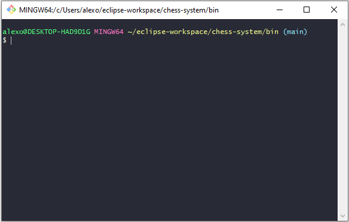

# Curso Java - Projeto Sistema Jogo de Xadrez
 

# Sobre o projeto

Projeto de estudo, do curso [**Java COMPLETO 2023 Programação Orientada a Objetos + Projetos**](https://www.udemy.com/course/java-curso-completo/learn/lecture/10836056#overview "Site do Curso") com o professor **Nelio Alves**  na plataforma Udemy.
Jogo acontece através do terminal, onde as peças são representadas por letras. As jogadas são definidas por coordenadas apresentadas no tabuleiro.

## Modelo Conceitual

# Tecnologias utilizadas
- Java 17
- Eclipse

# Conceitos
- POO
- Domínio
- Classes
- Atributos
- Métodos
- Variáveis
- Objetos
- Instâncias
- Exceções

# Para jogar
Como pré-requisito você deve ter um terminal instalado (Git Bash como exemplo).

Navegue a pasta bin do projeto. Para iniciar use o comando java application/Program.

Tela inicial do jogo com jogadores definidos por cores. O jogador deverá informar a posição inicial da peça que deseja movimentar.

)

Movimentação inicial com um peão, localizado na posição c2.

Baseado na sua escolha o sistema apresenta as opções de alvo, de acordo com a peça escolhida.

Definida como alvo a posição c4.

Jogada realizada com sucesso. Agora é a vez do oponente.

# Autor

Alexsandro Oliveira

https://www.linkedin.com/in/alexsandro-oliveira
